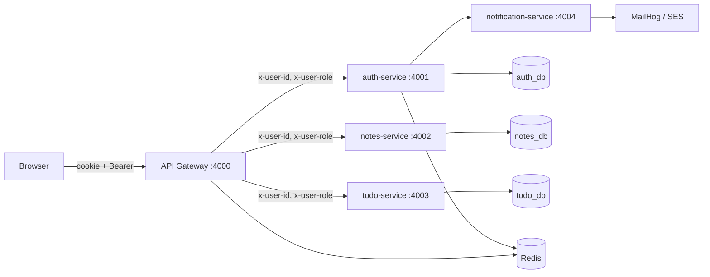

# Architecture

Six deployables: one Next.js UI, one public gateway, four Express + TypeScript services.
Three PostgreSQL databases, one Redis, one SMTP sink.

## Request flow

Only `web` (3000) and `api-gateway` (4000) are reachable from outside. Everything else is
private — enforced by the Docker bridge network locally and a Kubernetes NetworkPolicy in
production.

## Services and ports

| Service | Port | Owns | Datastore |
|---|---|---|---|
| `web` (Next.js) | 3000 | UI | — |
| `api-gateway` | 4000 | Public entry, JWT verify, rate limit, routing, logging | Redis (rate counters) |
| `auth-service` | 4001 | Users, sessions, JWT issuance, 2FA, password reset, audit log | `auth_db`, Redis |
| `notes-service` | 4002 | Notes, tags, categories, search | `notes_db` |
| `todo-service` | 4003 | Todos, labels | `todo_db` |
| `notification-service` | 4004 | Renders and sends email | — |
| PostgreSQL | 5432 | `auth_db`, `notes_db`, `todo_db` | — |
| Redis | 6379 | OTPs, mfaTokens, rate-limit counters | — |
| MailHog | 1025 / 8025 | Local fake SMTP + web inbox | — |

## Per service

**`web`** — Next.js App Router, Tailwind, React Query, Zustand. Talks only to the gateway. Holds
the access token **in memory** (never `localStorage`); the refresh token is an httpOnly cookie
the browser sends automatically. One `fetch` wrapper handles 401 → refresh → retry once, with a
single in-flight refresh promise so parallel 401s don't stampede.

**`api-gateway`** — the only publicly exposed API. Verifies the access token, strips any
client-supplied `x-user-*` headers, then sets `x-user-id` / `x-user-role` itself before
proxying. Also owns helmet, CORS allowlist, Redis-backed rate limiting, and `x-request-id`
generation for log correlation. Routing is a static table — no service discovery, no registry.

**`auth-service`** — the only service that knows what a password or a JWT is. Owns registration,
email verification, login, refresh-token rotation with reuse detection, logout, password reset,
session listing, TOTP/email-OTP/recovery-code 2FA, the admin user-management endpoints, and the
`AuditLog` table. Calls `notification-service` to send mail. Uses Redis for short-lived state
(`mfaToken`, email OTPs).

**`notes-service`** — CRUD for notes plus tags, categories, favourites, archive, and soft-delete
trash. Postgres full-text search over `title + content`. Stores markdown raw; sanitising happens
at render time in the browser.

**`todo-service`** — deliberately the same shape as notes-service: todos plus labels, status,
priority, due dates, soft delete. The structural duplication is intentional.

**`notification-service`** — one endpoint, `POST /internal/email`, guarded by a shared
`x-internal-key` header. Templates are plain functions returning `{ subject, html }`. Nodemailer
points at MailHog locally, SES in production.

## The two decisions that keep this simple

### 1. Only the gateway verifies JWTs

The gateway validates the access token and forwards `x-user-id` / `x-user-role`. Downstream
services just read those headers — no JWT library, no shared signing secret in notes or todo.

*Trade-off:* downstream services must be unreachable from outside, or anyone could forge those
headers. See [security-decisions.md](security-decisions.md).

### 2. No foreign keys across services

`notes.userId` and `todos.userId` are plain UUID strings. There is no join to the users table
and no cross-database transaction. Deleting a user does **not** cascade to their notes — that
would require an event or a cleanup job, and is out of scope.

This is what "microservice data ownership" means in practice: each service owns its schema and
migrations, and cross-service consistency is eventual or absent by design.

## Data ownership

| Database | Owned by | Tables |
|---|---|---|
| `auth_db` | auth-service | `User`, `Session`, `VerificationToken`, `RecoveryCode`, `AuditLog` |
| `notes_db` | notes-service | `Note`, `Tag`, `Category` |
| `todo_db` | todo-service | `Todo`, `Label` |

No service reads another service's database. Ever.

## Deliberately absent

Message queue, service mesh, gRPC, event sourcing, CQRS, service discovery. HTTP between
services is sufficient at this size — see [technology-choices.md](technology-choices.md) for the
reasoning and the cost.
